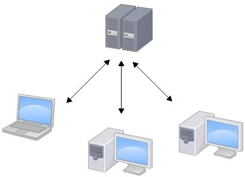
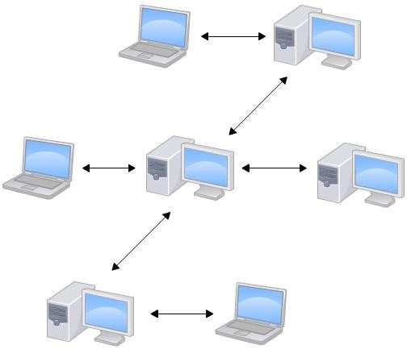
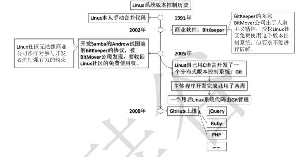
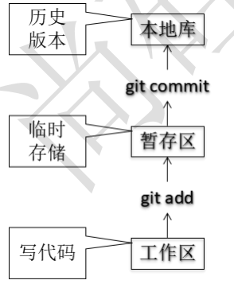
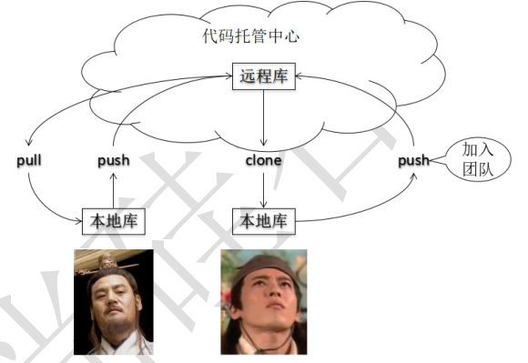
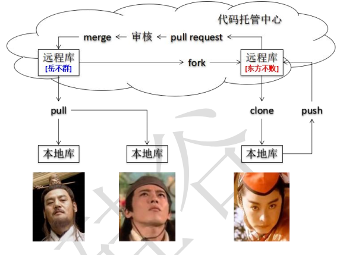

### git&github简介
lishuwei0424
#### 1 **版本控制工具应该具备的功能**

1.协同修改
   多人并行不悖的修改服务器端的同一个文件。
 2.数据备份 
   不仅保存目录和文件的当前状态， 还能够保存每一个提交过的历史状态。
 3.版本管理
   在保存每一个版本的文件信息的时候要做到不保存重复数据， 以节约存储空
 间，提高运行效率。 这方面 SVN 采用的是增量式管理的方式， 而 Git 采取了文
 件系统快照的方式。
 4.权限控制
   对团队中参与开发的人员进行权限控制。
   对团队外开发者贡献的代码进行审核——Git 独有。
 5.历史记录
   查看修改人、 修改时间、 修改内容、 日志信息。
   将本地文件恢复到某一个历史状态。
 6 分支管理
   允许开发团队在工作过程中多条生产线同时推进任务， 进一步提高效率。

#### 2 版本控制简介

##### 2.1版本控制

工程设计领域中使用版本控制管理工程蓝图的设计过程。 在 IT 开发过程中也可以

使用版本控制思想管理代码的版本迭代。

##### 2.2版本控制工具

思想： 版本控制

实现： 版本控制工具

集中式版本控制工具：

CVS、 SVN、 VSS……

##### 2.3 集中式vs分布式

​     Linus一直痛恨的CVS及SVN都是集中式的版本控制系统，而Git是分布式版本控制系统，集中式和分布式版本控制系统有什么区别呢？

​     先说集中式版本控制系统，版本库是集中存放在中央服务器的，而干活的时候，用的都是自己的电脑，所以要先从中央服务器取得最新的版本，然后开始干活，干完活了，再把自己的活推送给中央服务器。中央服务器就好比是一个图书馆，你要改一本书，必须先从图书馆借出来，然后回到家自己改，改完了，再放回图书馆。

​     集中式版本控制系统最大的毛病就是必须联网才能工作，如果在局域网内还好，带宽够大，速度够快，可如果在互联网上，遇到网速慢的话，可能提交一个10M的文件就需要5分钟，这还不得把人给憋死啊。

​     那分布式版本控制系统与集中式版本控制系统有何不同呢？首先，分布式版本控制系统根本没有“中央服务器”，每个人的电脑上都是一个完整的版本库，这样，你工作的时候，就不需要联网了，因为版本库就在你自己的电脑上。既然每个人电脑上都有一个完整的版本库，那多个人如何协作呢？比方说你在自己电脑上改了文件A，你的同事也在他的电脑上改了文件A，这时，你们俩之间只需把各自的修改推送给对方，就可以互相看到对方的修改了。

​     和集中式版本控制系统相比，分布式版本控制系统的安全性要高很多，因为每个人电脑里都有完整的版本库，某一个人的电脑坏掉了不要紧，随便从其他人那里复制一个就可以了。而集中式版本控制系统的中央服务器要是出了问题，所有人都没法干活了。

​     在实际使用分布式版本控制系统的时候，其实很少在两人之间的电脑上推送版本库的修改，因为可能你们俩不在一个局域网内，两台电脑互相访问不了，也可能今天你的同事病了，他的电脑压根没有开机。因此，分布式版本控制系统通常也有一台充当“中央服务器”的电脑，但这个服务器的作用仅仅是用来方便“交换”大家的修改，没有它大家也一样干活，只是交换修改不方便而已。

#### 3 Git 简介

##### 3.1Git 简史    

 文字描述见廖雪峰https://www.liaoxuefeng.com/wiki/896043488029600/896202815778784

##### 3.2Git 官网和 Logo

官网地址： https://git-scm.com/

##### 3.3Git 的优势

1.大部分操作在本地完成， 不需要联网
 2.完整性保证
 3.尽可能添加数据而不是删除或修改数据
 4.分支操作非常快捷流畅
 5.与 Linux 命令全面兼容

##### 3.4 git安装   

参考官网：

[https://git-scm.com/book/zh/v2/%E8%B5%B7%E6%AD%A5-%E5%AE%89%E8%A3%85-Git](https://git-scm.com/book/zh/v2/起步-安装-Git)

##### 3.5Git 结构    

#####  3.6Git 和代码托管中心

 代码托管中心的任务： 维护远程库  

   局域网环境下

​       GitLab 服务器

  外网环境下
       GitHub
         码云

##### 3.7本地库和远程库

###### 3.7.1 团队内部协作

###### 3.7.2 跨团队协作

 \

#### 4 Git 命令行操作

##### 4.1基本操作：

git init     初始化本地创库.git(master分支)

git add        将工作区的“新建/修改” 添加到暂存区

git config    配置签名  

​     作用：  区分不同开发人员的身份

    辨析：  这里设置的签名和登录远程库(代码托管中心)的账号、 密码没有任何关系。

git commit   暂存区提交到本地库

git status   本地库和暂存区的状态

git log      查看本地库递交记录

git reflog      和git log 差不多，带有会退的步数

git reset    回退 

​     其中一种：
​     基于索引值操作[推荐]

​     git reset --hard [局部索引值]

git diff     将工作区中的文件和暂存区进行比较

##### 4.2 分支管理

在版本控制过程中， 使用多条线同时推进多个任务。

分支的好处？

​     同时并行推进多个功能开发， 提高开发效率

​     各个分支在开发过程中， 如果某一个分支开发失败， 不会对其他分支有任何影响。 失败的分支删除重新开始即可。

**分支基本操作：**

git branch 创建名 创建分支

git branch –v   查看分支

git checkout 分支名 ：表示切换分支

**分支合并：**

第一步： 切换到接受修改的分支（被合并， 增加新内容） 上git checkout [被合并分支名]

第二步： 执行 merge 命令   git merge [有新内容分支名]

解决冲突
   冲突的表现

冲突的解决
   第一步： 编辑文件， 删除特殊符号

  第二步： 把文件修改到满意的程度， 保存退出
   第三步： git add [文件名]
   第四步： git commit -m "日志信息"
   注意： 此时 commit 一定不能带具体文件名

#### 5.其他操作

##### 5.1.gitignore文件

   在使用git作版本控制时,git会默认把git控制的文件夹里面的所有文件都加入到版本控制。但是在实践中,我们经常会遇到不想某些文件或文件夹被git追踪的情况.比如logs文件、代码构建过程中产生的一些列文件，要解决这种问题,通常情况下我们需要创建一个文件格式后缀名为.gitignore的文件,来控制哪些文件不被git追踪.

详解见https://www.cnblogs.com/langtianya/p/5748885.html

参考：https://github.com/github/gitignore写自己的.gitignore

##### 5.2.fork 

复制别人的代码，到自己的github上，这个还是属于自己的仓库，随便修改

##### 5.3.pull request

跨团队合作 Fork 完后，可以改完，上传本地仓库，想原始仓库提出pull request,然后对方来审核，过后进行merge。

##### 5.4.搭建gitlab服务器

1.Docker搭建gitlab服务器  https://www.cnblogs.com/majiang/p/11452363.html

2.Centos 7搭建Gitlab服务器超详细https://blog.csdn.net/duyusean/article/details/80011540

 

参考：

https://www.liaoxuefeng.com/wiki/896043488029600 

https://www.bilibili.com/video/av24441039

 
